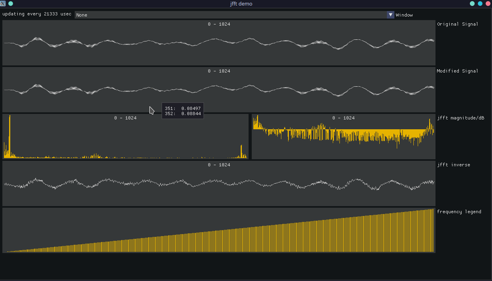

# jdsp - Jai Digital Signal Processing Utilities

| Feature | Description|
| --- | --- |
| `jfft` | Fast Fourier Transforms with various windowing functions |
| `jdsp_filter` | **WIP** Various filters including lowpass, highpass, bandstop, and bandpass |

---
#### `jfft`

`jfft` only processes real data sets at this time. No complex numbers. This means that instead of real/imaginary components we have sine/cosine.

`jfft_create_transformer :: (signal_length: int, allocator: Allocator = temp) -> *jfft_transformer #must`

> Sets up the memory needed to perform FFTs on inputs of a specific length. `signal_length` should be a power of two for best performance, but the only real requirement is that `signal_length` is even. Internal memory can be reused by `jfft_forward` and `jfft_backward`.

`jfft_destroy_transformer :: (jfft: *jfft_transformer)`

> If you used something other than `temp` as an allocator or you don't call `reset_temporary_storage` too often you can call this.

`jfft_forward :: (jfft: *jfft_transformer, input: []float32)`

> Performs an FFT on a given input buffer and puts sine/cosine components . `input` should match the `signal_length` of the transformer. DC is in bin `0`. Bins `1..N/2-1` contain frequency bins. Nyquist starts at bin `N/2`. Results can be fed into `jfft_magnitude_transform` or `jfft_magnitude_dB_transform` for useful analytics.

`jfft_forward_transform :: (input: []float32, allocator: Allocator = temp)`

> Creates `*jfft_transformer` internally. Same as `jfft_forward` otherwise. Good as a one-off.

`jfft_backward :: (jfft: *jfft_transformer, input: []float32)`

> Performs an inverse FFT on data returned from `jfft_forward`. Floating point errors mean that the original signal may not be able to be recreated exactly depending on original signal.

`jfft_backward_transform :: (input: []float32, allocator: Allocator = temp)`

>  Creates `*jfft_transformer` internally. Same as `jfft_backward` otherwise. Good as a one-off.

`jfft_magnitude_transform :: (input: []float32)`

> Modifies input in-place. Converts results of `jfft_forward` to be magnitude data up to `N/2` due to Nyquist-Shannon sampling theorem. This means that an FFT can only provide useful info for frequency bins of `sample_rate / 2`. Anything beyond `N/2` is imaginary or something (useful for reconstruction).

`jfft_magnitude :: (input: []float32, allocator: Allocator = temp) -> []float32 #must`

> Same as `jfft_magnitude_transform` but it returns a new array without touching original data.

`jfft_magnitude_db_transform :: (input: []float32)`

> Similar to `jfft_magnitude_transform` except converts the first `N/2` frequency bins to decibels.

`jfft_magnitude_db :: (input: []float32, allocator: Allocator = temp) -> []float32 #must`

> Same as `jfft_magnitude_db_transform` but returns a new array without touching original data.

---
Modifications to the frequency-domain data from `jfft_forward` would require overlap-add for successful `jfft_backward`. The successful execution of Fourier synthesis from modified frequency-domain data is on the programmer and outside the scope of the API at this time.

---

#### `jdsp_filter`

Working on it!

---

#### Example

Go into `example` and run `jai example.jai -release`. You should have an `sdl2` library accessible somewhere in case the one in `modules` doesn't work for you for whatever reason.

Run it like `./example`.

`UP/DOWN` will increase/decrease your chunk for FFT.

`SPACE` will pause the graphs at the current chunk.

`LEFT/RIGHT` will move to next/previous frame when paused.

`K/L` will decrease/increase the time betweeen chunks when unpaused.

Click the `Window` combo box at the top to see how different windows affect your input signal and FFT results.
